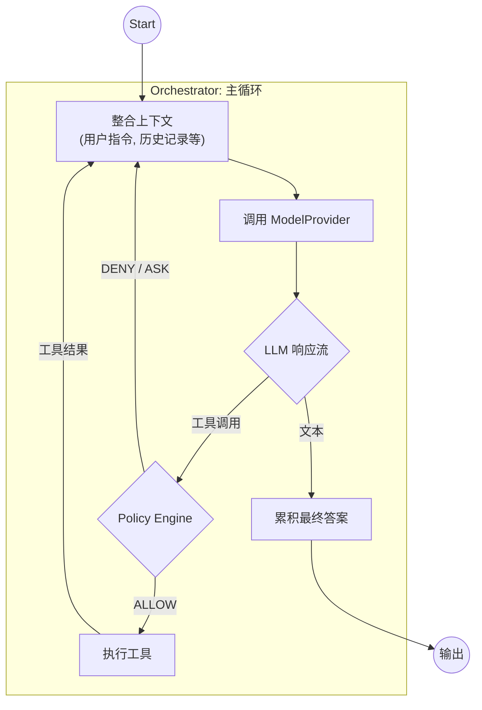

# MinAgent 技术设计文档

**版本**: 3.0
**状态**: 已采纳

## 1. 概述

本文档为 `MinAgent` 的核心开发者和贡献者提供了深入的技术架构和设计规范。其核心是借鉴 `google-gemini/gemini-cli` 的成熟模式，实现一个由 **LLM 驱动的 ReAct 循环**，并内置一个**策略引擎 (Policy Engine)** 以确保操作的安全性。

## 2. 核心架构

### 2.1. 设计哲学：LLM 驱动的 ReAct 循环
我们采用**反应式（Reactive）**而非**预设式（Prescriptive）**的架构。Agent 的每一步行动都由 LLM 根据当前完整的上下文动态决定，而非遵循一个预先生成、僵化的多步计划。

- **优势**: 灵活性高，能更好地应对工具执行失败、结果不符合预期等意外情况，并动态调整其后续行为。
- **核心循环**: `[获取上下文] -> [LLM 思考/决策] -> [执行/响应]`。此循环持续进行，直至 LLM 认为用户目标已达成。

### 2.2. 架构图：ReAct 与策略引擎



### 2.3. 核心组件详解

#### 2.3.1. Orchestrator (编排器)
- **定位**: Agent 的主控单元，负责驱动 ReAct 循环。
- **核心职责**:
    1.  **上下文管理**: 在循环开始时，整合所有可用信息（如用户的新 prompt、历史记录、`@file` 文件内容）作为 LLM 的输入。
    2.  **LLM 调用**: 与 `ModelProvider` 交互，并处理返回的响应。
    3.  **决策分发**: 判断 LLM 的输出是需要执行的**工具调用**还是**文本内容**。
    4.  **策略执行**: 将所有工具调用转发给**策略引擎**进行审查，并根据其裁决进行下一步操作（执行、拒绝或等待）。
    5.  **循环驱动**: 当一个工具被成功执行后，将其结果加入到上下文中，并**立即开始下一次循环**，让 LLM 基于新信息做出下一步决策。

#### 2.3.2. Policy Engine (策略引擎)
- **定位**: 安全门卫，Agent 执行危险操作（如文件写入、命令执行）前的最后一道防线。
- **核心职责**:
    1.  **审查**: 接收 `Orchestrator` 转发的工具调用请求。
    2.  **决策**: 根据 `config.yaml` 中定义的规则集，返回一个决策：`ALLOW`, `DENY`, 或 `ASK_USER` (未来扩展)。
- **配置示例 (`config.yaml`)**:
    ```yaml
    policy:
      rules:
        # 默认允许所有只读工具
        - decision: "allow"
          tool_pattern: "*_read"
        - decision: "allow"
          tool: "list_directory"
        # 默认拒绝所有工具
        - decision: "deny"
          tool: "*" 
        # 但明确允许 file_write 工具
        - decision: "allow"
          tool: "file_write"
          # (可以在此添加更细粒度的规则, e.g., 'args_match')
    ```

## 3. 数据结构

### 3.1. TaskContext
`TaskContext` 是任务状态的核心载体，它在不同的执行轮次之间被持久化。
- **`History`**: `[]*mcp.Message` - 存储完整的交互历史，是 LLM 做出决策的主要依据。
- **`Metadata`**: `map[string]interface{}` - 存储任务的元数据，如创建时间、任务类型等。
- **`PendingToolCalls`**: `[]*mcp.ToolCall` - 用于支持 `ASK_USER` 策略，存储等待用户确认的工具调用。

## 4. 接口定义 (Go)

### 4.1. ModelProvider
此接口定义了模型服务的统一契约，是实现模型可插拔的关键。
```go
package providers

// ModelProvider 定义了任何模型调用模块必须满足的契约。
type ModelProvider interface {
    GetName() string
    GenerateContent(ctx context.Context, history []*mcp.Message, tools []types.Tool) (*mcp.Response, error)
}
```

### 4.2. Tool
此接口定义了所有内置及外部工具的统一契约。
```go
package types

// Tool 定义了任何工具必须满足的契约。
type Tool interface {
	Name() string
	Schema() (json.RawMessage, error)
	Execute(args json.RawMessage) (string, error)
}
```

## 5. CLI 设计
*(此部分定义了用户与 Agent 交互的入口)*
- **`minagent [prompt] [flags]`**: 核心命令，用于启动一个任务。
    -   `--task <id>`: 加载或创建指定 ID 的任务，使其具备状态持久化能力。
    -   `@<filepath>`: 在 prompt 中引用本地文件，Agent 会自动读取其内容。
- **`minagent task <subcommand>`**: 用于管理已保存的任务。
- **`minagent tools <subcommand>`**: 用于列出所有可用的工具。
- **`minagent completion [shell]`**: 用于生成 shell 自动补全脚本。
