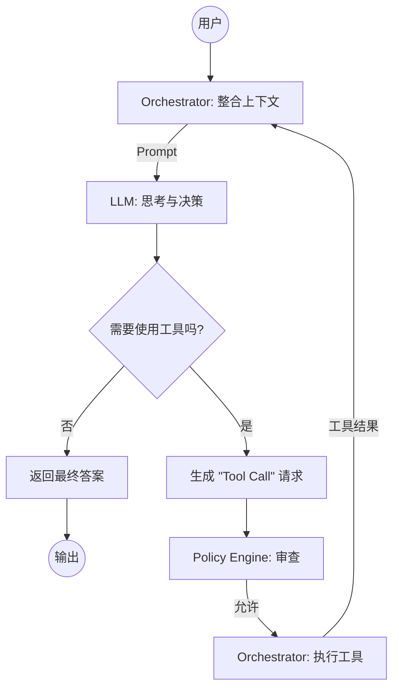

# MinAgent 🤖

MinAgent 是一个使用 Go 语言构建的、轻量级的本地 AI Agent 命令行工具。它旨在成为一个智能的、可扩展的、能与您的本地文件系统深度交互的开发助手。

## ✨ 核心特性

- **🤖 智能自主循环**: 借鉴 `google-gemini/gemini-cli` 的先进设计，Agent 采用由 LLM 驱动的 **ReAct (Reason-Act) 循环**。它能在每一步自主“思考”和“决策”，而不是遵循僵化的预设计划，从而更智能地完成复杂任务。

- **🛡️ 事前安全验证**: 内置一个**策略引擎 (Policy Engine)**，在执行任何有潜在风险的工具（如文件写入、执行 shell 命令）之前进行审查，确保 Agent 的所有操作都在您的掌控之中。

- **📄 上下文感知的文件交互**: 您可以在 Prompt 中使用 `@filepath` 语法，让 Agent 直接读取一个或多个本地文件的内容作为上下文，实现与您的项目无缝集成。

- **🛠️ 混合式工具系统**:
    - **内置核心工具**: 开箱即用，提供文件读写、目录列表等基础但强大的能力。
    - **外部插件扩展**: 支持通过插件目录轻松加载您自定义的可执行工具。

- **🚀 轻量与高效**: 使用 Go 语言原生编译，无额外运行时依赖，启动迅速，资源占用小。

- **🔄 任务状态持久化**: 能够将包含完整对话历史和执行状态的任务上下文保存到本地，随时可以中断和恢复，确保长任务的连贯性。

## 🚀 快速开始

#### 1. 配置
复制 `configs/config.yaml.example` 为 `config.yaml`，并填入您的模型 API Key。
```yaml
# config.yaml
llm:
  provider: "generic-http"
  model_name: "deepseek-chat"
  endpoint: "https://api.deepseek.com/chat/completions"
  api_key: "${YOUR_DEEPSEEK_API_KEY}" # 推荐使用环境变量
```

#### 2. 执行一个简单任务
```bash
# Agent 会自动推断任务类型并执行
minagent "用 Go 语言写一个简单的 Hello World Web 服务" --task "go-web-server"
```

#### 3. 与文件交互
```bash
# 让 Agent 读取 Design.md 文件并进行总结
minagent "总结一下 @Design.md 文件中的核心架构思想。" --task "summarize-design"
```

#### 4. 管理任务
```bash
# 列出所有已保存的任务
minagent task list

# 查看特定任务的上下文
minagent task view "go-web-server"
```

## ⚙️ 工作原理

MinAgent 的核心是一个由 LLM 驱动的 **ReAct (Reason-Act) 循环**。



这个循环让 Agent 能够像人一样思考：接收指令 -> 决定是否需要工具 -> 使用工具获取信息 -> 根据新信息继续思考，直到最终完成任务。

## 🔌 Shell 自动补全

`minagent` 支持为 Bash, Zsh, Fish, 和 PowerShell 生成自动补全脚本，极大提升使用体验。

### 安装

在您的 shell 配置文件 (如 `~/.bashrc`, `~/.zshrc`) 中添加以下对应行即可：

**Bash:**
```bash
source <(minagent completion bash)
```

**Zsh:**
```bash
source <(minagent completion zsh)
```
*(为了让其立即生效，请重启您的终端或运行 `source ~/.your_profile_file`)*

## 🤝 贡献

我们欢迎任何形式的贡献！如果您有好的想法或建议，请随时提出 Issue 或 Pull Request。在开始大的改动之前，请先查阅我们的 `Design.md` 技术设计文档。
